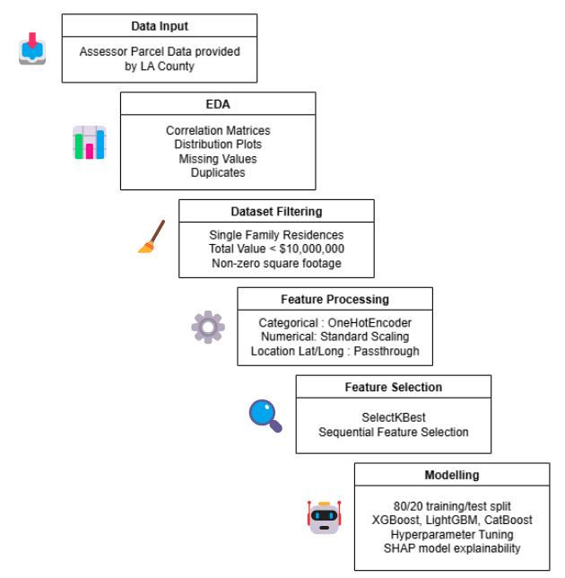
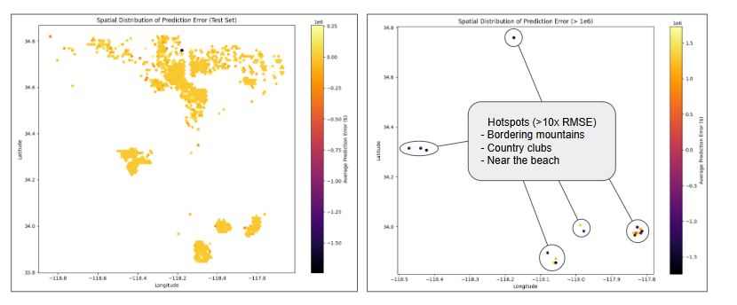

# Homely: A Transparent Home Valuation Tool

Welcome to **Homely**, a home valuation dashboard built by data scientists from the UC Berkeley MIDS program — Louis Young, Qiong Zhang, and Mohammed Elaubeir.

  

Our tool is designed to empower buyers, sellers, homeowners, and researchers by providing **transparent insights** into what affects a home's value and **why**.

---
## Our Mission: To bring Clarity and Confidence to Home Pricing

**Why This Matters**
- Buying or selling a home is one of the biggest financial decisions most people will ever make.
- We believe people deserve a better tool: a valuation they can understand and trust.

**Our Vision**
- Empower every buyer and seller with tools that are transparent, personalized, and data-driven.
- Bring fairness and clarity to the housing market – one home at a time.

---

## Project Goals

- Make home pricing **clear, fair, and interactive**
- Break down how **individual features** contribute to home value
- Enable users to explore **“what-if” scenarios** and compare neighborhoods
- Build trust in property valuation by avoiding black-box models

---

## Data Sources

Our project focuses on **Los Angeles County** and integrates over 25 features from public and proprietary sources:

- LA County Assessor’s Office  
- OpenStreetMap  
- Environmental, educational, and recreational datasets from LA County GIS datahub

---

## Homely Application Walkthrough Video

Watch this short video demo of the Homely application in action:

<iframe src="https://drive.google.com/file/d/1P68cGefBVQdY1cd_3p5wmzQN9Hc3tU_i/preview" width="100%" height="480" allow="autoplay"></iframe>

---
## Model

After multiple iterations of model testing and hyperparameter tuning, we selected the model with best performance, **XGBoost**, which achieved the lowest RMSE ($130,963.43) and Error (0.355). 

  

---

##  Prediction

Most of the estiamted house values that were predicted by our model align well with assessor value, except a few spots with higher error.

  

---

We hope Homely helps demystify home values and build confidence in your real estate journey.

---

## 📬 Questions or Feedback?

Reach out to us on GitHub or through our [project repository](https://github.com/QZhang0318/Homely_Web).

